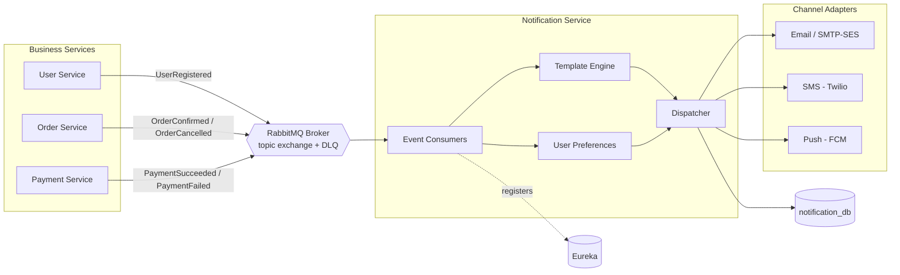

# Notification System — Feasibility & Design Analysis

## 1. Current State

The platform today has **no email, alert, or notification capability**. A code-wide
search for mail/SMTP, messaging brokers (Kafka, RabbitMQ/AMQP), cloud notification
services (SNS, SES, Twilio, SendGrid, Firebase), and WebSockets returns nothing except
the `email` **field** on the `users` table and prose in the docs. Concretely:

- No `spring-boot-starter-mail`, no broker starters, no push/SMS SDKs in any `pom.xml`.
- No message producers/consumers; all inter-service calls are **synchronous OpenFeign**.
- Key business events (order placed, payment success/failure, order cancelled/refunded)
  are handled entirely in-process in `OrderService` and simply returned in the HTTP
  response — nobody is informed out-of-band.

**Conclusion:** yes, a notification system can and should be added. The architecture is
already a clean microservices setup with Eureka discovery, per-service databases, and a
saga-based order flow, so a notification service slots in naturally.

## 2. Why It's Worth Adding

| Trigger event (already exists in code) | Notification value |
| --- | --- |
| User registration (`saveUser`) | Welcome email / verify address |
| Order placed & confirmed (`OrderService.placeOrder` → `CONFIRMED`) | Order confirmation with items and total |
| Payment success (`paymentStatus = SUCCESS`) | Payment receipt |
| Payment failed (`OrderStatus.PAYMENT_FAILED`) | "Payment failed, please retry" alert |
| Order cancelled / refunded (`cancelOrder`) | Cancellation + refund confirmation |
| Low stock on a product (`decreaseStock` crossing a threshold) | Ops/admin restock alert |

All of these map to events the system already computes but currently discards.

## 3. Design Options

### Option A — Synchronous Feign call to a notification-service (simplest)

Order/user/payment services call a new `notification-service` over Feign, exactly like
the existing `PaymentClient`/`ProductClient` pattern.

- **Pros:** matches current code style; smallest learning curve; no new infra.
- **Cons:** couples business flow to notification availability; a slow/down mail
  provider adds latency to (or fails) the order path unless carefully made async;
  retries are manual.
- **Verdict:** acceptable as a first iteration, but tighten by making the call
  fire-and-forget (`@Async`) so it never blocks order placement.

### Option B — Event-driven via RabbitMQ (recommended)

Business services publish domain events (`OrderConfirmed`, `PaymentFailed`,
`UserRegistered`) to a **RabbitMQ** broker. A standalone `notification-service`
subscribes and delivers via email/SMS/push.

- **Pros:** fully decouples notifications from the transactional path; natural retries
  and dead-letter handling; easy to add new channels/consumers later (analytics,
  loyalty) without touching producers; resilient if the mail provider is down.
- **Cons:** introduces new infrastructure (broker) and eventual-consistency semantics.
- **Verdict:** best long-term fit and the standard pattern for this event set. See
  [§3.1](#31-broker-choice-rabbitmq-vs-kafka) for why RabbitMQ is chosen over Kafka.

### 3.1 Broker choice: RabbitMQ vs. Kafka

Notifications are a **task/job workload** ("an order was confirmed → send one email"),
not an event-streaming or analytics workload. That distinction drives the choice.

| Factor | RabbitMQ | Kafka |
| --- | --- | --- |
| Best-fit pattern | Task queues / async jobs | Event streaming / durable log |
| Per-message retry + dead-letter | Built-in (DLX + TTL) | Manual (retry topics) |
| Operational complexity | Low — single broker, easy in Docker Compose | Higher — brokers + coordination + tuning |
| Throughput ceiling | More than enough for notifications | Extreme (overkill here) |
| Event replay / reprocessing | Not native | Native strength |
| Spring integration | Spring AMQP + `@RabbitListener`, minimal code | Spring Kafka, also good |
| Fit for **this** project | ✅ Strong | ⚠️ Over-engineered for now |

**Decision: RabbitMQ.** It matches the async-delivery-with-retries pattern exactly,
keeps operations simple, and drops cleanly into the existing Docker Compose + Spring
Boot setup. Kafka would only pay off if the platform later needs a replayable event log,
very high throughput, or many independent stream consumers (analytics, fraud,
recommendations). If that day comes, producers can publish to Kafka instead with the
notification-service as one consumer — the event-driven design here does not lock us in.

### Option C — Transactional Outbox (most robust)

Combine B with an **outbox table** per producing service: the business transaction
writes the event row in the same DB commit, and a relay publishes it to the broker.

- **Pros:** guarantees "notify iff the business change committed" — no lost or phantom
  notifications even if the broker is briefly unreachable. Fits the existing
  per-service-database model cleanly.
- **Cons:** most implementation effort (outbox table + relay/CDC).
- **Verdict:** the target state for production; layer it on top of Option B once the
  event flow is proven.

## 4. Recommended Architecture

Start with **Option B (event-driven notification-service)** and evolve toward the
outbox in Option C. This keeps the notification path off the critical order flow and
stays true to the platform's microservice principles.

*Figure: Event-driven notification flow. Business services publish domain events; the
notification-service consumes them and dispatches through channel adapters.*



### New service: `notification-service` (proposed :8086)

Following the existing layout (`controller` / `service` / `repository` / `model` /
`config`) and conventions (Eureka client, JWT filter, Flyway, own database):

| Component | Responsibility |
| --- | --- |
| Event consumers | Subscribe to domain events from the broker |
| Template engine | Render channel-specific content (e.g. Thymeleaf for HTML email) |
| Preference store | Per-user channel/opt-in settings (`notification_db`) |
| Dispatcher | Route to the correct channel adapter with retry + backoff |
| Channel adapters | Email (SMTP/SES), SMS (Twilio), push (FCM) behind a common interface |
| Delivery log | Persist attempts/status for audit and idempotency (`notifications` table) |

### Proposed data model (own database, per platform convention)

- **`notifications`**: `id`, `user_id` (logical ref), `channel`, `type`, `status`
  (`PENDING`/`SENT`/`FAILED`), `subject`, `payload`, `attempts`, `created_at`,
  `sent_at`, `event_id` (unique — idempotency key).
- **`notification_preferences`**: `id`, `user_id` (unique), `email_enabled`,
  `sms_enabled`, `push_enabled`.

`event_id` unique constraint gives **idempotent delivery** even if an event is
redelivered — the same pattern already used by `payments.uk_payments_order_id`.

### RabbitMQ topology and Spring AMQP sketch

A single **topic exchange** (`ecommerce.events`) with routing keys per event type lets
the notification-service bind exactly the events it cares about, and lets future
consumers bind others without changing producers.

| Element | Value |
| --- | --- |
| Exchange | `ecommerce.events` (topic, durable) |
| Routing keys | `order.confirmed`, `order.cancelled`, `payment.succeeded`, `payment.failed`, `user.registered` |
| Queue | `notifications.q` (durable) bound to `order.*`, `payment.*`, `user.*` |
| Dead-letter | `notifications.dlx` → `notifications.dlq` for messages that exhaust retries |

Producer side (e.g. order-service), using `spring-boot-starter-amqp`:

```java
// after the order reaches CONFIRMED
rabbitTemplate.convertAndSend(
        "ecommerce.events",              // exchange
        "order.confirmed",               // routing key
        new OrderConfirmedEvent(order.getId(), order.getUserId(),
                                 order.getTotalPrice()));
```

Consumer side (notification-service):

```java
@RabbitListener(queues = "notifications.q")
public void onEvent(DomainEvent event) {
    // idempotency guard on event_id, render template, dispatch via channel adapter
    notificationService.handle(event);
}
```

Retry/backoff is configured declaratively (Spring Retry + DLX), so a transient mail
outage causes redelivery rather than a lost notification, and repeated failures land in
`notifications.dlq` for inspection.

## 5. Integration Points (minimal change to existing code)

- **order-service** — after `placeOrder` reaches `CONFIRMED` / `PAYMENT_FAILED`, and in
  `cancelOrder`, publish the corresponding event. In Option A this is a fire-and-forget
  Feign call; in Option B it's a `rabbitTemplate.convertAndSend(...)` to the
  `ecommerce.events` exchange. No change to the saga's core logic.
- **payment-service** — publish `PaymentSucceeded` / `PaymentFailed` from
  `PaymentService.process` / `refund`.
- **user-service** — publish `UserRegistered` from `saveUser`.
- **gateway** — add a route `Path=/api/notifications/**` and OpenAPI entry, mirroring
  the existing route definitions.

## 6. Cross-Cutting Concerns

| Concern | Approach |
| --- | --- |
| Reliability | Broker retries + dead-letter queue; outbox (Option C) for exactly-once intent |
| Idempotency | Unique `event_id` per notification row |
| Security | Reuse JWT filter for the admin/query API; internal token or broker ACLs for producers |
| Privacy / opt-in | `notification_preferences` respected before dispatch; unsubscribe support |
| Observability | Actuator health + delivery-log metrics (sent/failed per channel) |
| Config | Provider credentials via environment variables / secrets, not `application.yml` |
| Templating | Externalized templates so copy changes need no redeploy |

## 7. Phased Rollout

1. **Phase 1 — MVP:** `notification-service` + email adapter, driven by an async Feign
   call from order-service for order confirmation and payment-failed alerts.
2. **Phase 2 — Event-driven:** introduce the broker; move producers to publish events;
   add user-registration welcome email and cancellation/refund notices.
3. **Phase 3 — Multi-channel + preferences:** add SMS and push adapters and the
   `notification_preferences` store with opt-in handling.
4. **Phase 4 — Hardening:** transactional outbox, dead-letter handling, delivery
   dashboards and alerting on failed sends.

## 8. Effort & Risk Summary

| Aspect | Assessment |
| --- | --- |
| Architectural fit | High — clean addition; no rework of existing services |
| Code change to existing services | Low — a few event publishes at known points |
| New infrastructure | RabbitMQ + a mail/SMS/push provider (Phase 2+) |
| Main risk | Eventual consistency and provider outages — mitigated by RabbitMQ retries/DLQ + outbox |
| Recommended first step | Phase 1 MVP (email + async call), then evolve to RabbitMQ events |

## 9. Recommendation

Add a dedicated **`notification-service`** and adopt an **event-driven** approach
(Option B) using **RabbitMQ** as the broker, starting with an email MVP (Phase 1) and
progressing to RabbitMQ-based events and a transactional outbox. RabbitMQ is chosen over
Kafka because notifications are an async task/job workload where per-message retries and
dead-lettering matter more than replayable-log streaming, and because it keeps operations
simple within the existing Docker Compose + Spring Boot setup. This keeps notifications
entirely off the transactional critical path, preserves the platform's microservice and
database-per-service principles, and lets new channels or consumers be added later
without modifying the services that produce the events.
