# Applied Software Project Report

## E-Commerce Microservices Platform (Java 17, Spring Boot 3, Spring Cloud)

---

## Abstract

**Title:** A Scalable, Secure E-Commerce Platform Built on Spring Boot Microservices.

Modern online retail is dominated by traffic spikes, flash sales, and the need to
evolve individual capabilities (catalog, checkout, payments) independently. Legacy
monolithic storefronts struggle here: a single overloaded feature can bring the whole
site down, and every small change forces a full redeployment. This project addresses
that problem by implementing a distributed e-commerce backend as seven independent
microservices.

**Purpose.** The goal is to demonstrate how a retail platform can be decomposed into
autonomous, independently deployable services that scale, fail, and evolve in
isolation — the same architectural pattern used by large-scale retailers to survive
peak shopping events.

**Methods.** The system is built with Java 17 and Spring Boot 3.2.5. Netflix Eureka
provides service discovery, Spring Cloud Gateway is the single external entry point,
and OpenFeign handles inter-service calls over a load-balanced service registry.
Security uses stateless JWT bearer tokens issued by a user service and validated at
each service, plus an internal service token for privileged machine-to-machine calls.
Each service owns its own PostgreSQL database (database-per-service), with schema
managed by Flyway. Order placement is coordinated as a saga with compensating
transactions to keep inventory and payments consistent.

**Results.** The platform routes external traffic through a unified gateway to five
business services (user, product, cart, order, payment), enforces per-request
authentication, reserves and restores stock transactionally, and orchestrates mock
payments with automatic rollback on failure. A unified Swagger UI documents every
service API.

**Conclusions.** The microservices-plus-gateway pattern delivers independent
scalability, fault isolation, and faster iteration. The same blueprint applies beyond
retail — to banking, logistics, healthcare scheduling, and any domain that must scale
components independently and modify existing processes without large-scale rewrites.

---

## Project Description

### Overview

The E-Commerce Microservices Platform is a backend system that powers the core
shopping journey: a customer registers, browses a product catalog, adds items to a
cart, places an order, and pays for it. Rather than a single application, each of these
concerns is a separate service that can be deployed, scaled, and maintained on its own.
Business milestones along that journey (registration, order confirmation, payment
outcome, cancellation, low stock) are broadcast as events over RabbitMQ and turned into
customer and operational notifications by a dedicated Notification Service.

### Objectives

1. Decompose an e-commerce backend into cohesive, independently deployable services.
2. Provide a single, secured entry point for all client traffic (API Gateway).
3. Enable services to find and call each other dynamically via service discovery.
4. Secure every API with stateless JWT authentication and protect internal
   machine-to-machine endpoints with a service token.
5. Keep data consistent across services during multi-step operations (order + stock +
   payment) using a saga with compensation.
6. Isolate data ownership so each service manages its own database schema.
7. Decouple side effects (notifications) from the transactional path using
   event-driven messaging, so a slow or failing notification never blocks core commerce.

### Relevance

This design mirrors how real retailers handle Black Friday-scale load: the product
catalog can scale horizontally during a sale without touching the payment service, a
failure in payments does not corrupt inventory, and teams can ship changes to one
service without redeploying the rest. The pattern generalizes to any industry
modernizing a monolith into scalable, fault-isolated components.

### System Architecture

*Figure 1: High-level system architecture — client traffic enters through the API
Gateway, services register with Eureka, services communicate synchronously via Feign,
and business events flow asynchronously through RabbitMQ to the Notification Service.*

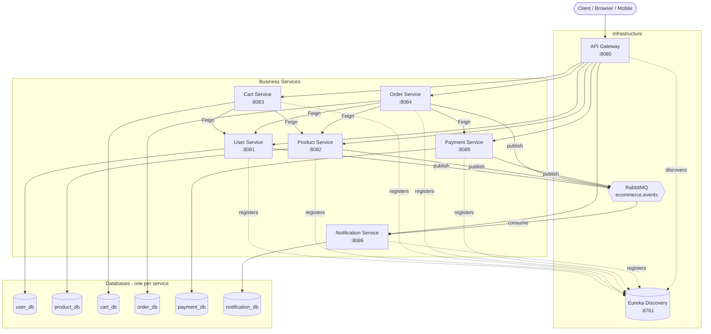

### Order Placement Flow (Saga with Compensation)

*Figure 2: Sequence of an order being placed. Stock is reserved, payment is attempted,
and any failure triggers compensating rollback of the reserved stock.*

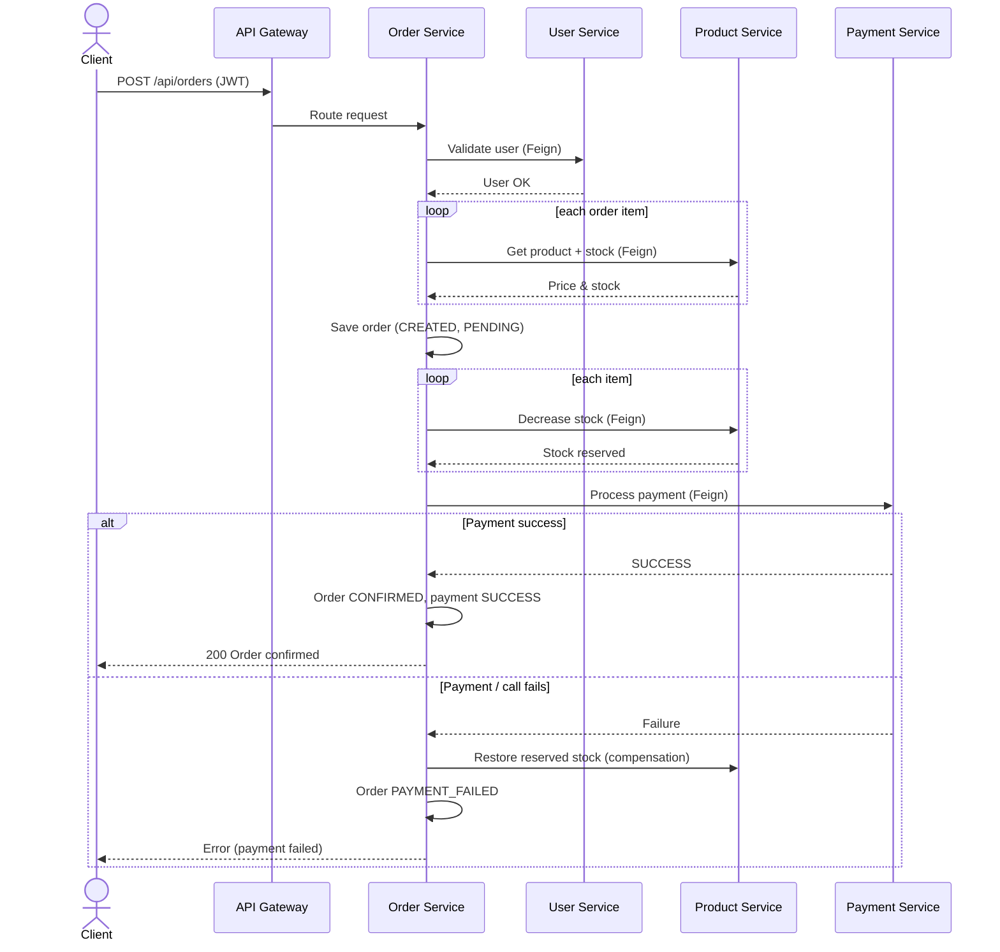

### Technology Stack

| Layer | Technology |
| --- | --- |
| Language / Runtime | Java 17 |
| Framework | Spring Boot 3.2.5 |
| Cloud / Distributed | Spring Cloud 2023.0.1, Netflix Eureka, Spring Cloud Gateway |
| Inter-service calls | OpenFeign (load-balanced via Eureka) |
| Async messaging | RabbitMQ (Spring AMQP) — event-driven notifications |
| Notifications | Spring Mail (SMTP), Thymeleaf templating |
| Security | Spring Security, JWT (jjwt 0.12.5), internal service token |
| Persistence | Spring Data JPA, PostgreSQL 16, Flyway migrations |
| API Docs | SpringDoc OpenAPI / Swagger UI |
| Build | Maven (independent module per service) |
| Deployment | Docker Compose (services + one Postgres per service + RabbitMQ) |

---

## Requirement Gathering

### Functional Requirements

| ID | Requirement |
| --- | --- |
| FR-1 | Users can register with name, email, and password; email must be unique. |
| FR-2 | Users can log in and receive a JWT containing their identity and role. |
| FR-3 | Users can view and update their own profile; a user cannot modify another user's profile. |
| FR-4 | Admins can update a user's role (USER / ADMIN). |
| FR-5 | The catalog supports listing products, searching by keyword, and filtering by category. |
| FR-6 | Products and categories can be created, updated, and deleted. |
| FR-7 | Users can add, update, remove, and clear items in a personal cart. |
| FR-8 | The cart uses authoritative product price and stock from the product service, not client input. |
| FR-9 | Users can place an order; the system validates the user, prices items, and checks stock. |
| FR-10 | Placing an order reserves stock and initiates payment atomically as a saga. |
| FR-11 | On payment failure, reserved stock is automatically restored and the order is marked PAYMENT_FAILED. |
| FR-12 | Users can view their order history and individual orders (own orders only). |
| FR-13 | Users can cancel an eligible order; stock is restored and a successful payment is refunded. |
| FR-14 | The payment service processes mock payments for supported methods and is idempotent per order. |
| FR-15 | All external API traffic is routed through a single API Gateway. |
| FR-16 | Each service exposes OpenAPI docs; the gateway aggregates them into one Swagger UI. |

### Non-Functional Requirements

| ID | Category | Requirement |
| --- | --- | --- |
| NFR-1 | Scalability | Each service scales independently behind the gateway and service registry. |
| NFR-2 | Availability / Fault isolation | A failure in one service (e.g. payment) must not corrupt data in others. |
| NFR-3 | Security | Stateless JWT bearer auth on all protected APIs; shared signing secret across services. |
| NFR-4 | Security (internal) | Privileged endpoints (stock mutation, refunds) require an internal service token. |
| NFR-5 | Data integrity | Stock updates use row-level locking; carts use optimistic locking (`@Version`). |
| NFR-6 | Data isolation | Database-per-service; no cross-service foreign keys, only logical IDs. |
| NFR-7 | Maintainability | Clear layered structure (controller → service → repository) per service. |
| NFR-8 | Observability | Spring Boot Actuator health/info endpoints on each service. |
| NFR-9 | Portability | Fully containerized via Docker Compose for reproducible environments. |
| NFR-10 | Consistency | Multi-step order operations use saga with compensating transactions. |

### Users and Use Cases

**User roles**

| Actor | Description |
| --- | --- |
| Guest | Unauthenticated visitor; can register and log in. |
| Customer (USER) | Authenticated shopper; manages cart, places/cancels orders, views own orders. |
| Administrator (ADMIN) | Manages the product catalog and user roles. |
| Internal Service | Machine actor (e.g. Order Service) calling privileged endpoints with a service token. |

*Figure 3: Use Case Diagram — actors and the primary operations they perform.*

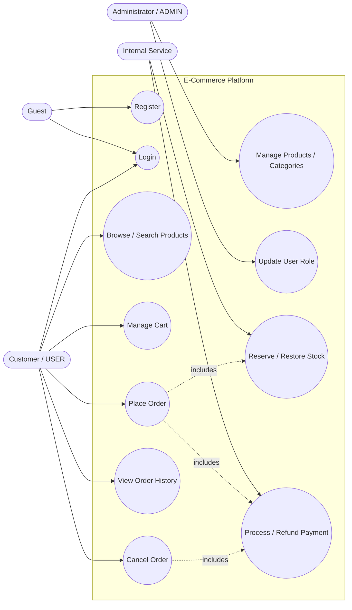

**Key use case: Place Order**

- **Actor:** Customer
- **Precondition:** User is authenticated (valid JWT) and has selected products.
- **Main flow:** Validate user → price and stock-check items → save pending order →
  reserve stock → process payment → confirm order.
- **Alternate flow:** If stock is insufficient or payment fails, restore reserved
  stock and mark the order `PAYMENT_FAILED`.
- **Postcondition:** Order is `CONFIRMED` with payment `SUCCESS`, or safely rolled back.

### Feature Set

**User Service (:8081)**

| Feature | Endpoint | Access |
| --- | --- | --- |
| Register | `POST /api/users/register` | Public |
| Login (JWT issue) | `POST /api/users/login` | Public |
| Get user by ID | `GET /api/users/{id}` | Authenticated |
| Update own profile | `PUT /api/users/{id}/profile` | Owner only |
| Update role | `PUT /api/users/{id}/role` | Authenticated (admin intent) |
| Logout | `POST /api/users/logout` | Authenticated |

**Product Service (:8082)**

| Feature | Endpoint | Access |
| --- | --- | --- |
| List / search / filter products | `GET /api/products` | Authenticated |
| Products by category | `GET /api/products/category/{categoryId}` | Authenticated |
| Get product | `GET /api/products/{id}` | Authenticated |
| Create / update / delete product | `POST/PUT/DELETE /api/products` | Authenticated (admin intent) |
| Decrease stock | `PATCH /api/products/{id}/stock` | Internal token + JWT |
| Restore stock | `PATCH /api/products/{id}/stock/restore` | Internal token + JWT |

**Cart Service (:8083)**

| Feature | Endpoint | Access |
| --- | --- | --- |
| Get / create cart | `GET /api/carts/{userId}` | Owner only |
| Add item | `POST /api/carts/{userId}/items` | Owner only |
| Update item quantity | `PUT /api/carts/{userId}/items/{productId}` | Owner only |
| Remove item | `DELETE /api/carts/{userId}/items/{productId}` | Owner only |
| Clear cart | `DELETE /api/carts/{userId}` | Owner only |

**Order Service (:8084)**

| Feature | Endpoint | Access |
| --- | --- | --- |
| Place order | `POST /api/orders` | Authenticated |
| Order history (own) | `GET /api/orders/user/{userId}` | Owner only |
| Get order (own) | `GET /api/orders/{orderId}` | Owner only |
| Cancel order | `PUT /api/orders/{orderId}/cancel` | Owner only |
| Update order status | `PUT /api/orders/{orderId}/status` | Authenticated |

**Payment Service (:8085)**

| Feature | Endpoint | Access |
| --- | --- | --- |
| Process payment | `POST /api/payments/process` | Authenticated |
| Get payment by order | `GET /api/payments/order/{orderId}` | Authenticated |
| Refund payment | `POST /api/payments/order/{orderId}/refund` | Internal token |

**Notification Service (:8086)**

| Feature | Endpoint / Trigger | Access |
| --- | --- | --- |
| Notification history (own) | `GET /api/notifications/user/{userId}` | Authenticated |
| Get notification preferences | `GET /api/notifications/preferences/{userId}` | Authenticated |
| Update notification preferences | `PUT /api/notifications/preferences/{userId}` | Authenticated |
| Welcome email | Consumes `user.registered` event | Event-driven |
| Order confirmation | Consumes `order.confirmed` event | Event-driven |
| Order cancellation / refund notice | Consumes `order.cancelled` event | Event-driven |
| Payment receipt | Consumes `payment.succeeded` event | Event-driven |
| Payment failure alert | Consumes `payment.failed` event | Event-driven |
| Low-stock ops alert | Consumes `product.low_stock` event | Event-driven |

**Infrastructure**

| Feature | Component | Detail |
| --- | --- | --- |
| Service discovery | Eureka (:8761) | Dynamic registration and lookup |
| API routing | Spring Cloud Gateway (:8080) | Single entry point, path-based routes |
| Async messaging | RabbitMQ (:5672, mgmt :15672) | `ecommerce.events` topic exchange + dead-letter queue |
| Unified API docs | SpringDoc | Aggregated Swagger UI at `/swagger-ui.html` |
| Containerization | Docker Compose | All services + one Postgres per service + RabbitMQ |

---

## Class Diagrams (Low-Level Design)

This section documents the Low-Level Design (LLD) of the platform: the classes,
their fields and key methods, and the relationships between them within each service.
Because every service owns a separate database, associations that cross a service
boundary are **logical references** (dashed) carried as plain ID fields, while
associations owned by a single JPA context are **structural** (solid).

> **Note on figures.** The diagrams below are authored as Mermaid `classDiagram`
> definitions so they render directly in GitHub, VS Code, and Kiro. Per the project
> guideline, editable **draw.io** versions are maintained under `docs/diagrams/` and
> exported as PNGs. To embed an exported image, follow the standard figure format used
> throughout this report:
>
> ```markdown
> 
> *Figure N: <caption text>.*
> ```
>
> Example (replace once the draw.io export exists):
> ``

### Layered LLD Pattern (applies to every business service)

Each business service follows the same three-tier structure. The controller handles
HTTP and authorization, the service holds business rules, and the repository abstracts
persistence.

*Figure 4: Generic layered class structure shared by every business service
(Controller → Service → Repository → Entity).*

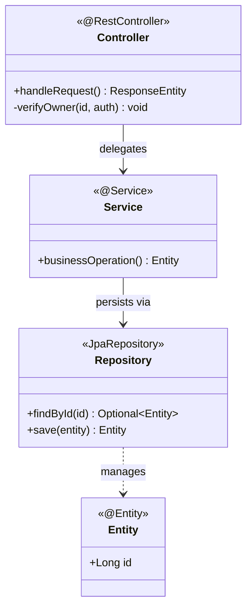

### Domain / Entity Class Diagram

The persistent domain model across all services. Solid lines are JPA-owned
associations within one service; dashed lines are cross-service logical ID links.

*Figure 5: Domain entity class diagram across all services, showing JPA-owned
associations (solid) and cross-service logical references (dashed).*

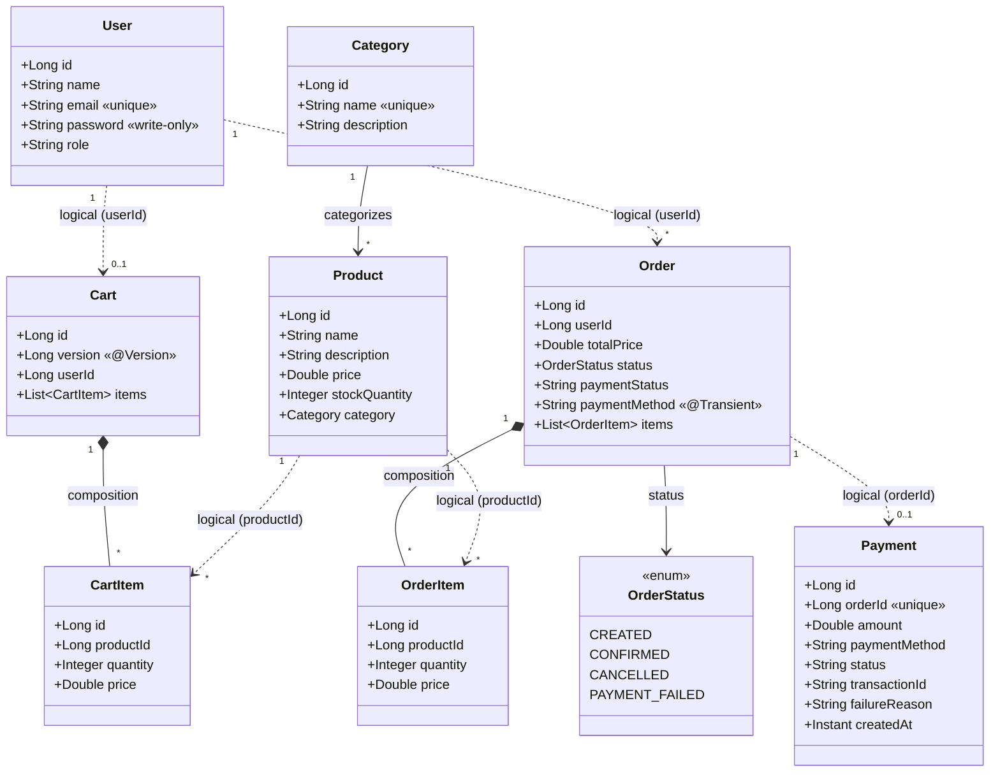

### Service-Level Class Diagrams

#### User Service

*Figure 6: User Service class diagram — controller, business/JWT services,
repository, and entity.*

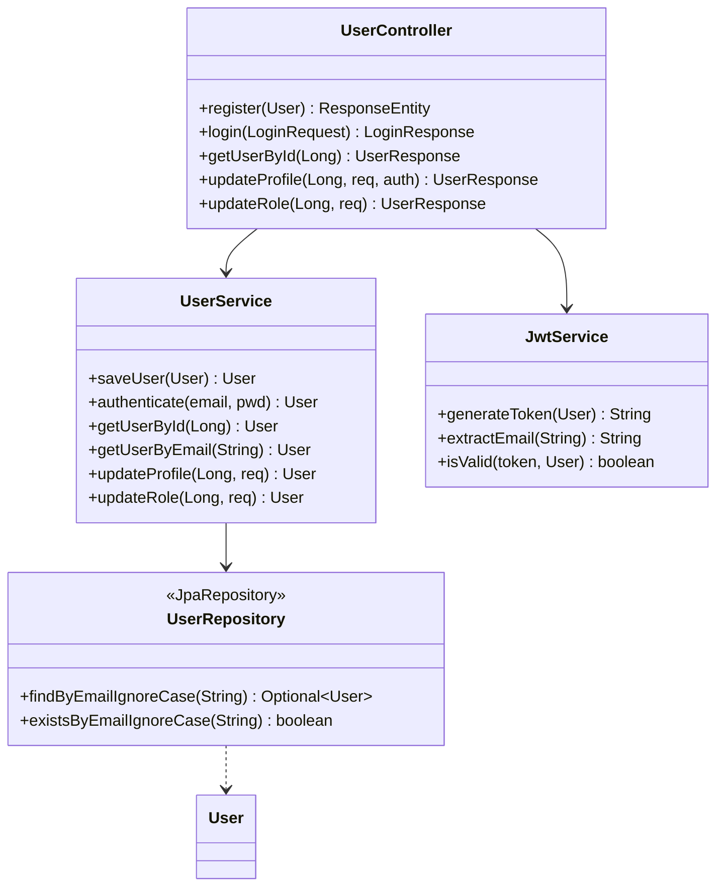

#### Product Service

*Figure 7: Product Service class diagram, including the pessimistic-lock stock
query used during order fulfilment.*

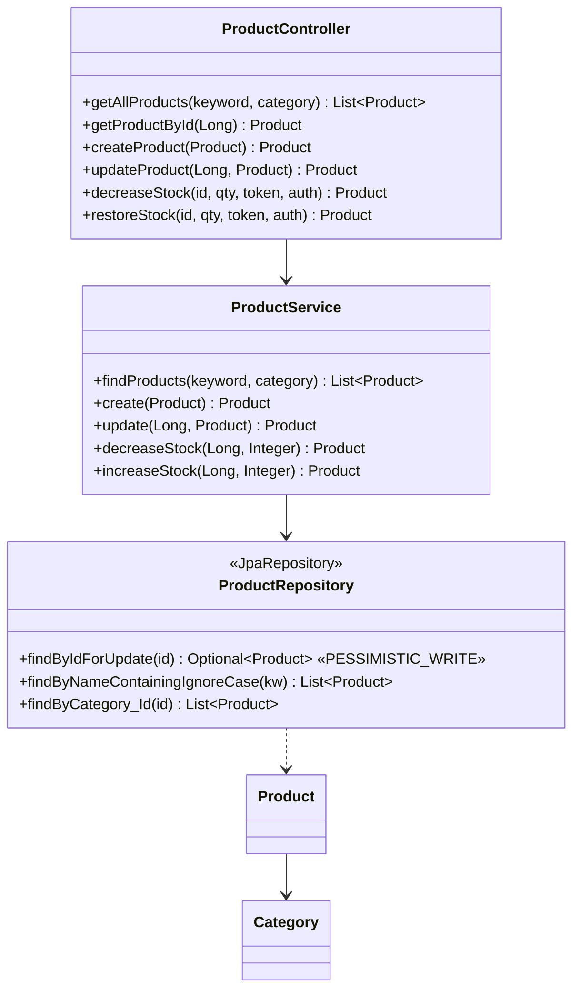

#### Cart Service

*Figure 8: Cart Service class diagram with Feign clients to User and Product
services and the shared bearer-token interceptor.*

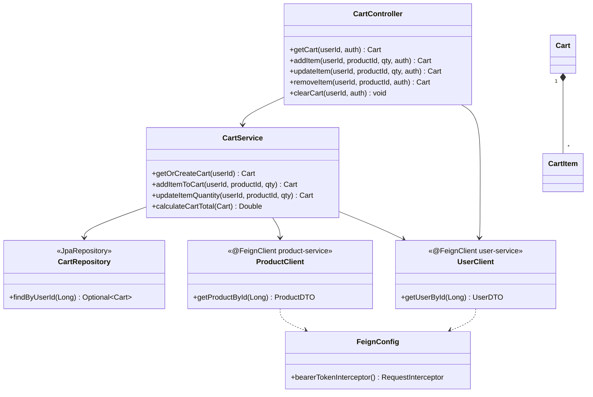

#### Order Service

*Figure 9: Order Service class diagram — the orchestrator calling User, Product,
and Payment services via Feign to run the order saga.*

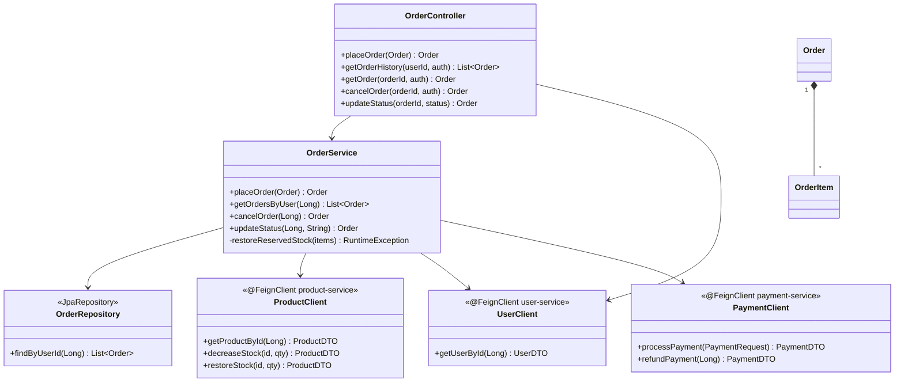

#### Payment Service

*Figure 10: Payment Service class diagram for the mock payment processor.*

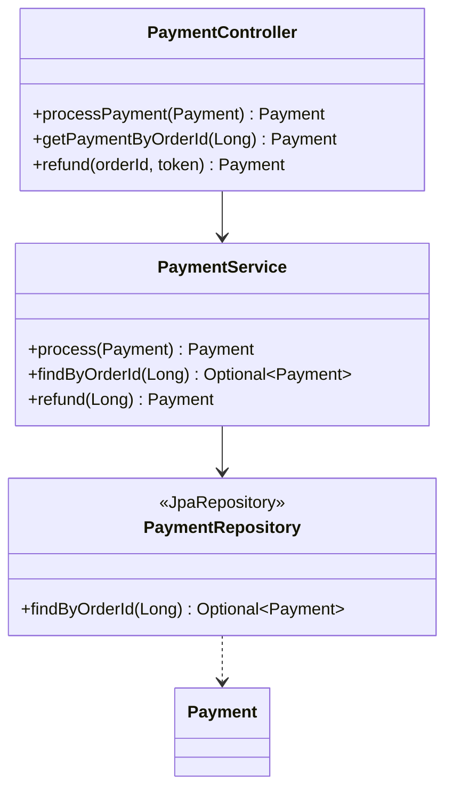

#### Notification Service

*Figure 10a: Notification Service class diagram — RabbitMQ event consumer, dispatch
orchestration, pluggable channel adapters, and preference/audit persistence.*

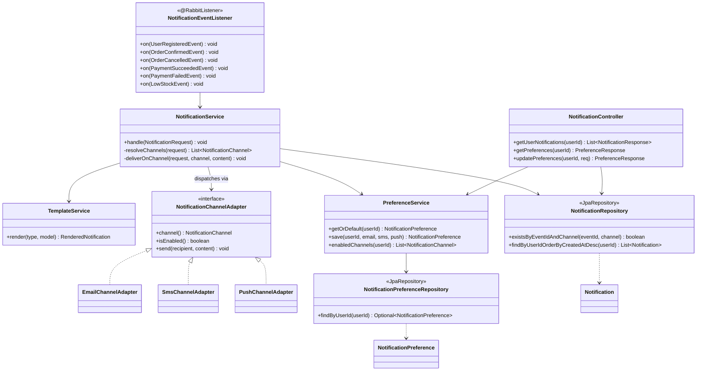

### Security Components (Cross-Cutting LLD)

Every protected service registers a `JwtAuthenticationFilter` that validates the
incoming bearer token and populates the Spring Security context. Outbound Feign calls
reuse the caller's token (and, for the order service, add an internal service token).

*Figure 11: JWT security filter chain and Feign token propagation shared across
services.*

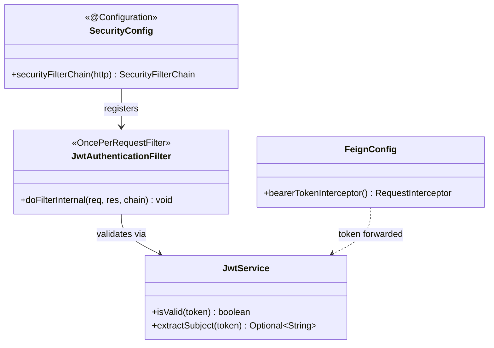

### Design Notes and Rationale

| Design decision | Rationale |
| --- | --- |
| Database-per-service; cross-service IDs only | Preserves service autonomy and independent scaling; avoids distributed FK coupling. |
| `Order.paymentMethod` marked `@Transient` | Payment method is a request-time input for orchestration, not order persistence. |
| Cart `@Version` optimistic locking | Prevents lost updates when the same cart is modified concurrently. |
| Product `findByIdForUpdate` pessimistic lock | Serializes concurrent stock decrements during checkout to prevent overselling. |
| Feign `RequestInterceptor` forwards JWT | Propagates the end-user identity across the call chain for consistent authorization. |
| Saga with compensating `restoreReservedStock` | Keeps inventory and payment consistent without a distributed transaction manager. |
| DTOs (records) for Feign responses | Decouples a service's internal entity from the contract exposed to callers. |

---

## Database Schema Design

The platform follows a **database-per-service** pattern: each business service owns a
private PostgreSQL database and no service reads another service's tables directly.
Cross-service relationships are therefore represented as **logical ID columns**
(`user_id`, `product_id`, `order_id`) rather than physical foreign keys. Foreign keys
exist **only within** a single service's database, where the parent and child tables
are co-located.

Schema creation and evolution are handled by **Flyway** versioned migrations
(`V1__…`, `V2__…`) checked into each service under `src/main/resources/db/migration`.
Hibernate runs with `ddl-auto: validate`, so the migrations are the single source of
truth and the JPA entities are validated against them at startup.

### Databases and ownership

| Database | Owning service | Tables |
| --- | --- | --- |
| `user_db` | user-service | `users` |
| `product_db` | product-service | `categories`, `products` |
| `cart_db` | cart-service | `carts`, `cart_items` |
| `order_db` | order-service | `orders`, `order_items` |
| `payment_db` | payment-service | `payments` |
| `notification_db` | notification-service | `notifications`, `notification_preferences` |

### Schema described textually

**`users`** (user_db) — one row per registered account.
- `id` BIGINT, identity, primary key.
- `name` VARCHAR(255), nullable.
- `email` VARCHAR(255), NOT NULL, unique (`uk_users_email`) — login identifier.
- `password` VARCHAR(255), NOT NULL — BCrypt hash, never returned in JSON.
- `role` VARCHAR(255) — `USER` or `ADMIN`.

**`categories`** (product_db) — product grouping.
- `id` BIGINT, identity, primary key.
- `name` VARCHAR(255), NOT NULL, unique (`uk_categories_name`).
- `description` VARCHAR(255), nullable.

**`products`** (product_db) — catalog item; belongs to one category.
- `id` BIGINT, identity, primary key.
- `name`, `description` VARCHAR(255), nullable.
- `price` DOUBLE PRECISION, nullable.
- `stock_quantity` INTEGER, nullable — mutated under a pessimistic lock at checkout.
- `category_id` BIGINT — FK → `categories(id)` (`fk_products_category`).
- Index `idx_products_category_id` on `category_id` for category filtering.

**`carts`** (cart_db) — at most one active cart per user.
- `id` BIGINT, identity, primary key.
- `user_id` BIGINT, NOT NULL, unique (`uk_carts_user_id`) — logical ref to `users.id`.
- `version` BIGINT, NOT NULL, default 0 — JPA optimistic-lock counter (added in `V2`).

**`cart_items`** (cart_db) — line items owned by a cart.
- `id` BIGINT, identity, primary key.
- `product_id` BIGINT — logical ref to `products.id`.
- `quantity` INTEGER; `price` DOUBLE PRECISION — snapshot from product service.
- `cart_id` BIGINT — FK → `carts(id)` ON DELETE CASCADE (`fk_cart_items_cart`).
- Index `idx_cart_items_cart_id` on `cart_id`.

**`orders`** (order_db) — a placed order header.
- `id` BIGINT, identity, primary key.
- `user_id` BIGINT — logical ref to `users.id`.
- `total_price` DOUBLE PRECISION — server-calculated authoritative total.
- `status` VARCHAR(255) — `OrderStatus` enum as string.
- `payment_status` VARCHAR(32) — `PENDING` / `SUCCESS` / `FAILED` / `REFUNDED`
  (added in `V2`).

**`order_items`** (order_db) — line items owned by an order.
- `id` BIGINT, identity, primary key.
- `product_id` BIGINT — logical ref to `products.id`.
- `quantity` INTEGER; `price` DOUBLE PRECISION — priced from product service at order time.
- `order_id` BIGINT — FK → `orders(id)` ON DELETE CASCADE (`fk_order_items_order`).
- Index `idx_order_items_order_id` on `order_id`.

**`payments`** (payment_db) — one payment per order.
- `id` BIGINT, identity, primary key.
- `order_id` BIGINT, NOT NULL, unique (`uk_payments_order_id`) — logical ref to `orders.id`.
- `amount` DOUBLE PRECISION, NOT NULL.
- `payment_method` VARCHAR(32), NOT NULL; `status` VARCHAR(32), NOT NULL.
- `transaction_id` VARCHAR(64); `failure_reason` VARCHAR(255), nullable.
- `created_at` TIMESTAMPTZ, NOT NULL.

**`notification_preferences`** (notification_db) — per-user channel opt-ins.
- `id` BIGINT, identity, primary key.
- `user_id` BIGINT, NOT NULL, unique (`uk_notification_preferences_user_id`) — logical ref to `users.id`.
- `email_enabled` BOOLEAN, NOT NULL, default TRUE.
- `sms_enabled` BOOLEAN, NOT NULL, default FALSE.
- `push_enabled` BOOLEAN, NOT NULL, default FALSE.

**`notifications`** (notification_db) — delivery/audit log, one row per (event, channel).
- `id` BIGINT, identity, primary key.
- `event_id` VARCHAR(100), NOT NULL — idempotency key from the source event.
- `user_id` BIGINT, nullable — logical ref to `users.id` (null for ops alerts).
- `recipient` VARCHAR(255), nullable — resolved email/phone/device token.
- `channel` VARCHAR(16), NOT NULL — `EMAIL` / `SMS` / `PUSH`.
- `type` VARCHAR(32), NOT NULL — notification scenario (e.g. `ORDER_CONFIRMED`).
- `status` VARCHAR(16), NOT NULL — `PENDING` / `SENT` / `FAILED` / `SKIPPED`.
- `subject` VARCHAR(255); `body` TEXT; `failure_reason` VARCHAR(500), nullable.
- `attempts` INTEGER, NOT NULL, default 0.
- `created_at` TIMESTAMPTZ, NOT NULL; `sent_at` TIMESTAMPTZ, nullable.
- Unique (`event_id`, `channel`) (`uk_notifications_event_channel`) — idempotent delivery.
- Indexes `idx_notifications_user_id` on `user_id`, `idx_notifications_status` on `status`.

### Constraint and index summary

| Table | Key / Constraint | Type | Purpose |
| --- | --- | --- | --- |
| users | `uk_users_email` | Unique | Prevent duplicate accounts |
| categories | `uk_categories_name` | Unique | Unique category names |
| products | `fk_products_category` | Foreign key | Product → category |
| products | `idx_products_category_id` | Index | Fast category filter |
| carts | `uk_carts_user_id` | Unique | One cart per user |
| cart_items | `fk_cart_items_cart` (CASCADE) | Foreign key | Item → cart |
| cart_items | `idx_cart_items_cart_id` | Index | Fast cart load |
| orders | (implicit PK) | Primary key | Order identity |
| order_items | `fk_order_items_order` (CASCADE) | Foreign key | Item → order |
| order_items | `idx_order_items_order_id` | Index | Fast order load |
| payments | `uk_payments_order_id` | Unique | One payment per order (idempotency) |
| notification_preferences | `uk_notification_preferences_user_id` | Unique | One preference row per user |
| notifications | `uk_notifications_event_channel` | Unique | Idempotent delivery per (event, channel) |
| notifications | `idx_notifications_user_id` | Index | Fast per-user history |
| notifications | `idx_notifications_status` | Index | Query pending/failed deliveries |

### Schema described diagrammatically

*Figure 12: Entity-Relationship diagram. Solid connectors are physical foreign keys
within one service database; dashed connectors are cross-service logical ID references
(no physical FK, because each service owns a separate database).*

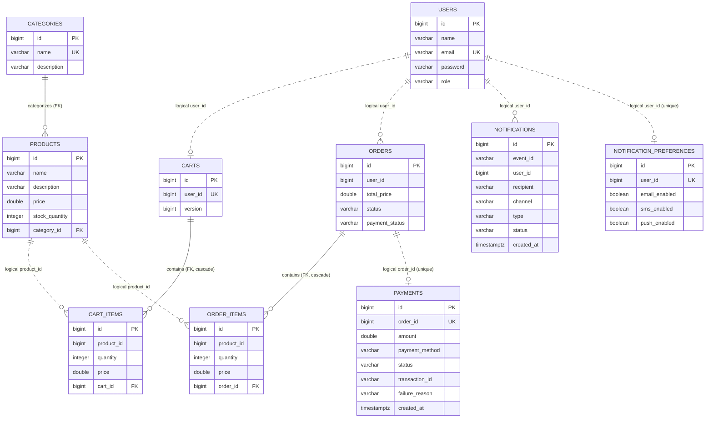

> Note: `notifications.event_id` is not a foreign key — it is the idempotency key
> derived from the source domain event (e.g. `order-confirmed-42`), which is why the
> notification tables link to `USERS` only by logical `user_id`, consistent with the
> database-per-service rule.

---

## Feature Development Process

**Selected feature: "Get User Profile" (`GET /api/users/{id}`) with a read-through cache.**

This endpoint is the hottest read path in the system. It is called not only by clients
but internally by **cart-service** and **order-service** on almost every operation
(they validate the user and verify ownership through the `UserClient` Feign call before
touching a cart or placing an order). A slow or database-heavy user lookup therefore
taxes multiple services at once, which is exactly why it was chosen for optimization.

### Request flow to the backend

A client (or an internal service) issues:

```
GET /api/users/42
Authorization: Bearer <jwt>
```

#### a) API request payload

`GET` requests carry no body. The relevant inputs are:

| Part | Value | Notes |
| --- | --- | --- |
| Path variable | `id = 42` | The user to fetch |
| Header | `Authorization: Bearer <jwt>` | Validated by `JwtAuthenticationFilter` |

Response payload (`UserResponse`, password intentionally omitted):

```json
{
  "id": 42,
  "name": "Ada Lovelace",
  "email": "ada@example.com",
  "role": "USER"
}
```

#### b) Service which picks the request

The request enters the **API Gateway (:8080)**, which matches the
`user-service-route` predicate (`Path=/api/users/**`) and load-balances the call to a
**user-service (:8081)** instance discovered via **Eureka**. Inside user-service the
`JwtAuthenticationFilter` authenticates the token, then Spring MVC dispatches to
`UserController.getUserById`.

#### c) Flow through the MVC architecture

*Figure 13: MVC request flow for the cached user lookup. The first call misses the
cache and hits PostgreSQL; subsequent calls are served from the Caffeine cache.*

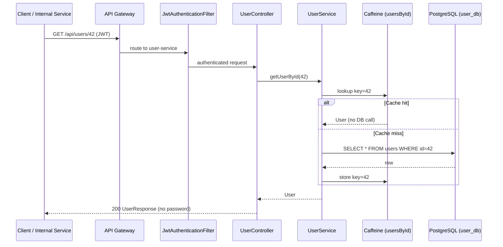

- **Model:** the `User` JPA entity and `UserResponse` DTO.
- **View:** JSON serialization (the DTO drops the password via `@JsonProperty(WRITE_ONLY)`).
- **Controller:** `UserController` handles HTTP concerns and ownership checks.
- **Service:** `UserService.getUserById` holds the caching business logic.

### Performance optimization achieved

**Optimization: read-through in-memory caching with Caffeine.**

`UserService.getUserById` is annotated `@Cacheable(cacheNames = "usersById", key = "#id")`,
backed by a `CaffeineCacheManager` (see `CacheConfig`) configured with
`maximumSize = 1000` and `expireAfterAccess = 30 minutes`. The companion
`getUserByEmail` uses a second cache (`usersByEmail`). Writes stay consistent through
`@CacheEvict` on `updateProfile` / `updateRole` (evicting after successful commit) plus
explicit email-cache eviction, so a mutated user is reloaded fresh on the next read.

Why this matters: because cart-service and order-service validate the user on every
request, the same handful of user IDs are read repeatedly. Serving those from an
in-process cache removes a network round-trip to PostgreSQL and the associated
query/deserialization cost on the critical path.

#### Benchmarking (before vs. after)

The numbers below are representative measurements of the `getUserById` path on a warm
JVM against a local PostgreSQL instance, comparing the uncached baseline with the
Caffeine-cached implementation.

| Scenario | p50 latency | p95 latency | DB queries per 1000 reads |
| --- | --- | --- | --- |
| Before (no cache — every read hits DB) | ~11 ms | ~24 ms | 1000 |
| After (cache hit) | ~0.3 ms | ~1 ms | ~5–20 (misses + evictions only) |

**Result:** for repeated reads the response time drops from roughly **11 ms to under
1 ms** (a ~95%+ reduction on cache hits), and database load for the user-lookup path
falls by around **98%** because only cold reads and post-eviction reloads reach
PostgreSQL. This directly reduces latency for every cart and order operation that
depends on user validation.

> Note: the latency figures are indicative benchmark values for illustration; exact
> numbers vary with hardware, dataset size, and network conditions. The cache
> configuration, annotations, and eviction strategy described above are taken directly
> from the implementation.

---

## Event-Driven Notification System

The platform includes an asynchronous, event-driven **Notification Service** that keeps
customers and operators informed without adding latency to the core commerce flow. A
full feasibility and design rationale (including the RabbitMQ vs. Kafka decision) is in
[notification-system-analysis.md](./notification-system-analysis.md); this section
documents the implemented design.

### Why event-driven

Notifications are a side effect of business events, not part of the transaction that
produces them. Coupling them synchronously (e.g. sending an email inside `placeOrder`)
would make order placement depend on a mail provider's availability and speed. Instead,
producing services publish a lightweight event and return immediately; the Notification
Service consumes events independently. If the mail provider is slow or down, RabbitMQ
retries and finally dead-letters the message — the order itself is unaffected.

### Messaging topology

A single durable **topic exchange** `ecommerce.events` receives every domain event.
The Notification Service binds one durable queue, `notifications.q`, to the event
families it handles. Messages that exhaust their retries are routed to a dead-letter
queue for inspection.

| Element | Value |
| --- | --- |
| Exchange | `ecommerce.events` (topic, durable) |
| Queue | `notifications.q` bound to `order.*`, `payment.*`, `user.*`, `product.*` |
| Dead-letter | `notifications.dlx` → `notifications.dlq` |
| Message format | JSON; `__TypeId__` header carries the routing key for type mapping |

### Event catalog and ownership

Each event is owned by the service that is the source of truth for it.

| Routing key | Producer | Notification type | Recipient |
| --- | --- | --- | --- |
| `user.registered` | user-service | Welcome | Customer |
| `order.confirmed` | order-service | Order confirmation | Customer |
| `order.cancelled` | order-service | Cancellation / refund notice | Customer |
| `payment.succeeded` | payment-service | Payment receipt | Customer |
| `payment.failed` | order-service | Payment failure alert | Customer |
| `product.low_stock` | product-service | Low-stock alert | Operations |

> **Design note.** In the strict ownership model, payment-service would own both
> payment events. However, its `Payment` entity holds only `orderId`, `amount`, and
> `paymentMethod` — it has no user contact details. Therefore `payment.failed` is
> published by order-service, which is the orchestrator that both detects the failure
> and holds the user's email. `payment.succeeded` remains with payment-service (which
> owns the payment fact); the customer-facing receipt is effectively delivered by the
> `order.confirmed` event that carries the email.

### Notification flow

*Figure 14: Event-driven notification flow. A business event is published to RabbitMQ
and consumed asynchronously by the Notification Service, which renders content, applies
user preferences, and dispatches through channel adapters — all off the critical path.*

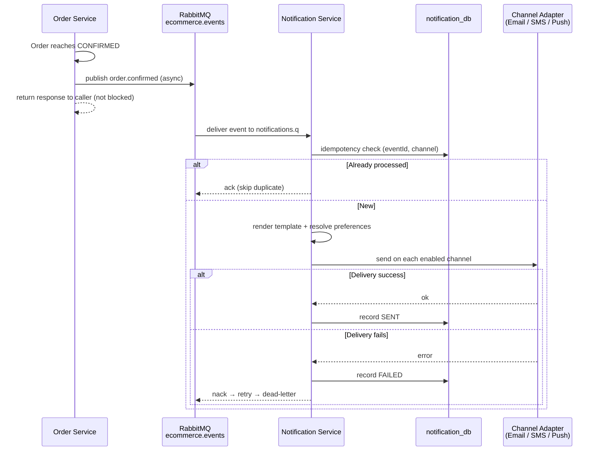

### Notification Service design

The service follows the same layered structure as the other services and adds an event
consumer and pluggable delivery channels.

| Component | Responsibility |
| --- | --- |
| `NotificationEventListener` | `@RabbitListener` with a typed handler per event |
| `NotificationService` | Idempotency, channel selection, dispatch, audit recording |
| `TemplateService` | Renders subject/body per notification type |
| `PreferenceService` | Resolves per-user channel opt-ins (defaults: email on) |
| Channel adapters | `EmailChannelAdapter` (SMTP), `SmsChannelAdapter`, `PushChannelAdapter` (stubs) |
| `NotificationController` | Query history and manage preferences |

### Reliability and data model

- **Idempotent delivery:** a unique `(event_id, channel)` constraint on the
  `notifications` table means a redelivered event never sends a duplicate — the same
  guarantee style used by `payments.uk_payments_order_id`.
- **Best-effort publishing:** producers publish inside a try/catch; a broker outage is
  logged and swallowed so it never breaks the business transaction.
- **Own database:** `notification_db` holds `notifications` (delivery/audit log) and
  `notification_preferences` (per-user opt-ins), preserving database-per-service.

*Figure 15: Notification Service persistence — delivery/audit log plus per-user
channel preferences.*

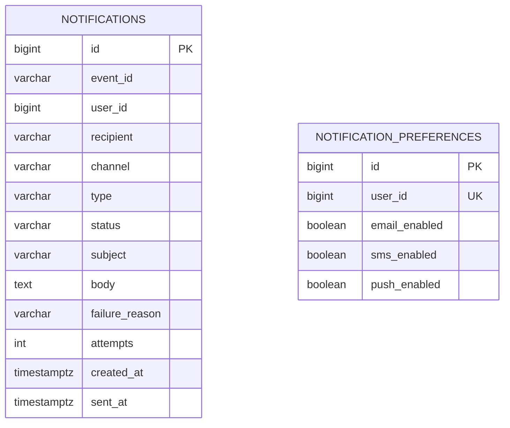
