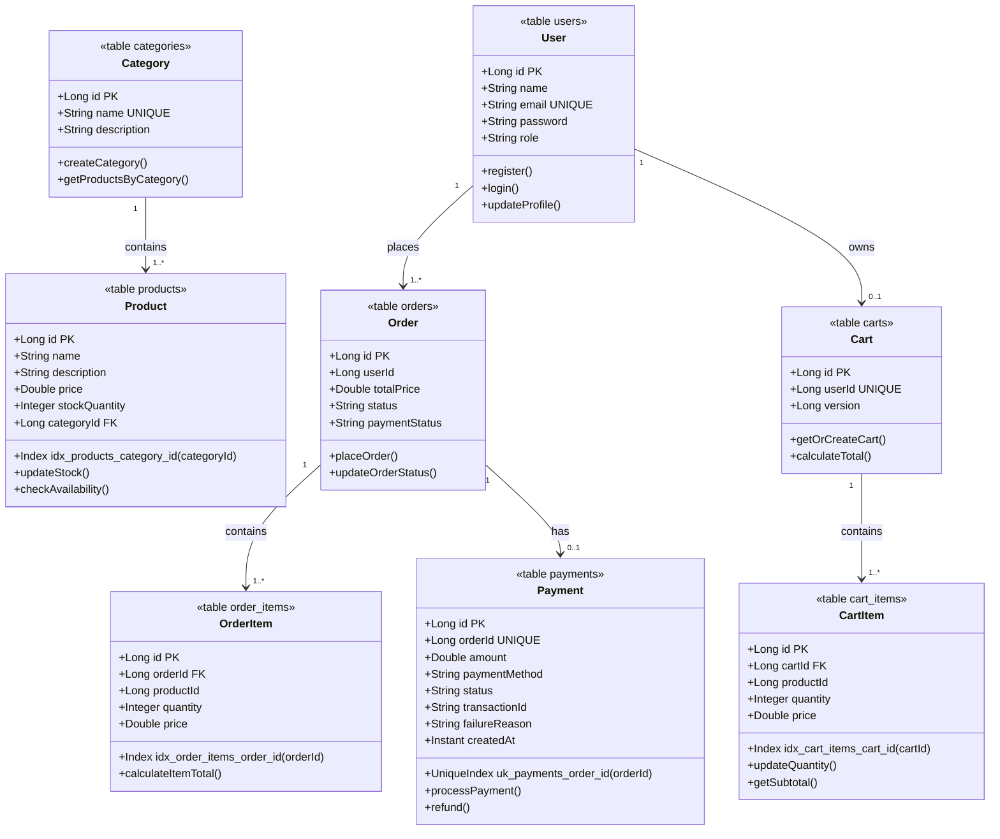

# E-Commerce Database UML Diagram

**Legend**

- `PK` = primary key.
- `FK` = database foreign key.
- `UNIQUE` = unique constraint or unique column.
- `Index` and `UniqueIndex` show database indexes.
- Solid relationships represent database-owned foreign keys.
- Dashed relationships represent logical cross-service references; these are
  not database foreign keys.
